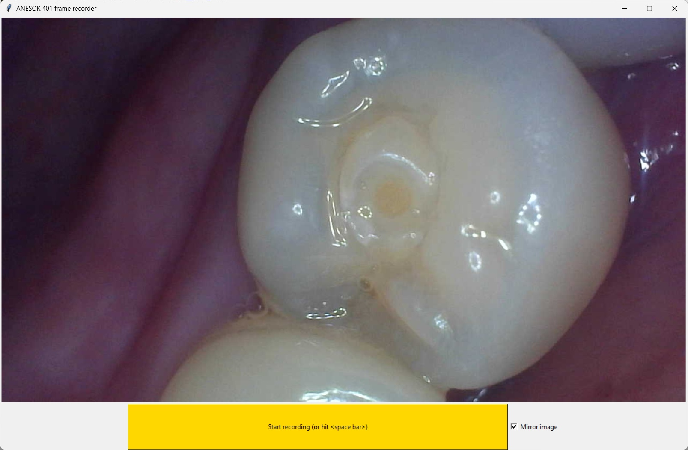
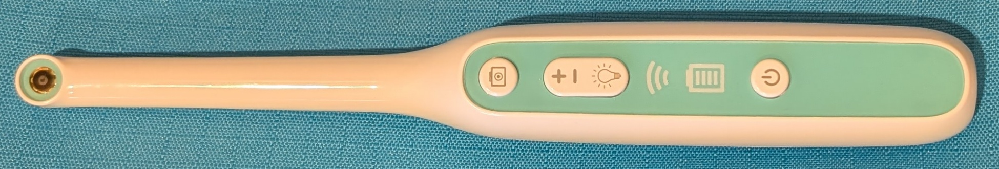
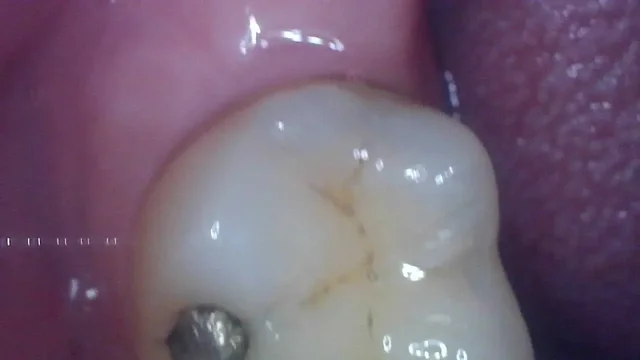
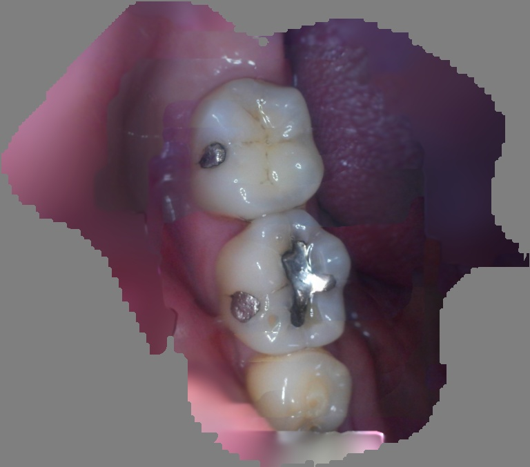
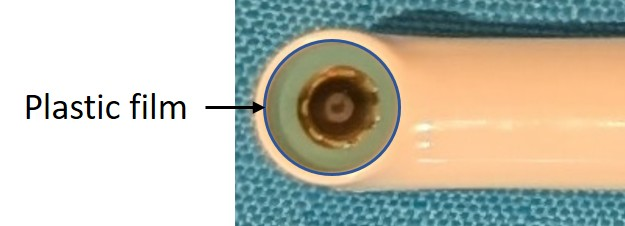

# View and record Dental Camera video stream frames as a sequence of JPEG images

Screenshot of GUI  

Dental Camera  

Example sequence of recorded frame images  

Author: [Mark Hsieh](https://github.com/mcmhsieh)

## Acknowledgements
 * Substantially based on [MJPEG Mirror for Suear "Smart" Ear Cleaners](https://github.com/SeanPesce/Suear-Web-Viewer) by [Sean Pesce](https://github.com/SeanPesce)

## Purpose

The recorded frames are saved to a directory as individual JPEG images files, which makes them readily viewable and selectable as input for my research project: https://github.com/mcmhsieh/Smile (currently under development), to generate systhesised views by stitching together the collection of frame images.

Example synthesised view generated from a longer sequence of frames  

## About the Dental Camera

Bought from an online marketplace with very little information about its manufacturer or model on the item's listing, packaging, instructions or the device itself.  

The instructions call it "Model: 401", and directs the user to use an app called "ANESOK" on Google Play or Apple App store.

Its Wifi SSID is "ANESOK-401-*xxxx*", and the vendor/model/version information it returns once connected is "YPC/TX806-XRH-401/V24".

Searching online, it appears to be the [SUNUO® 401 Wifi Dental Camera Oral Endoscope](http://anesoksunuo.com/dental-camera/199.html) made by Shenzhen Sulang Technology Co., Ltd, "ANESOK" and "INSKAM" seem to be alternative names associated with "SUNUO".

There is further information about the family of these devices in the [README of Sean Pesce's MJPEG Mirror for Suear "Smart" Ear Cleaners](https://github.com/SeanPesce/Suear-Web-Viewer/blob/main/README.md).

The clarity of the captured images can be improved by removing the stick-on clear plastic film covering the LEDs and camera lens on the Dental Camera device, although the the instructions accompanying the device do not appear mention the presence of the film.  

## Usage (Microsoft Windows)

- Clone https://github.com/mcmhsieh/ANESOK-401-frame-recorder.git or download a copy of the repository
- Install Python 3.11 and Python Poetry
- Create a virtual environment, activate it, and use Poetry to install the dependencies
- Power on the Dental Camera device and set the LED brightness to the dimmest setting
- Connect to the Dental Camera device's WiFi ("ANESOK-401-*xxxx*")
  - Optionally set the WiFi connection as a private connection
  - Optionally manually add a Windows Firewall inbound rule for python.exe (or add it at the automatic prompt when the frame recorder utility is run for the first time)
  - Optionally add an IPv4 route for 192.168.1.1 to the WiFi interface (in an elevated command prompt) if the system is connected to another router (e.g. via Ethernet) that is also at 192.168.1.1
- Run the frame recorder utility in the activated virtual environment `python.exe frame_recorder.py`
- Click the "Start recording" button (or hit space bar key) to start and stop recording images to the `./recorded_frames` subdirectory

## License

[GNU General Public License v2.0](LICENSE)
